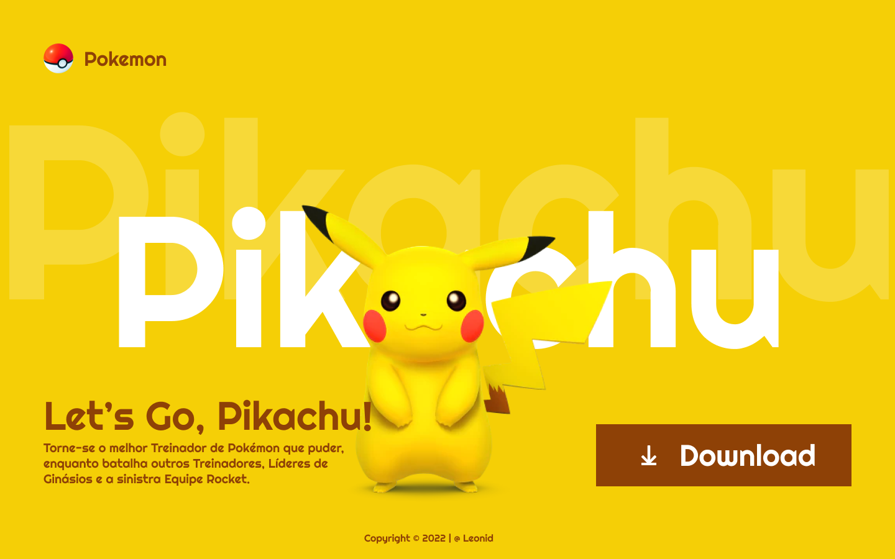

# Landing Page - Let's Go, Pikachu

---

## Sobre
Site do tipo landing page, para divulgar o jogo Let's Go Pikachu.
O intuito desse projeto é colocar em prática o conhcecimento adquirido sobre as linguagens de marcacao, HTML, CSS e Markdown, realizadas no curso técnico de desenvolvimento de sistemas do [SENAI Jandira](https://sp.senai.br/unidade/jandira/) 

---

## Tecnologias Utilizadas
- HTML
- CSS
- Markdown
- Git
---

## Autor
- [Thayná de Oliveira](thaynaofreire.senai@gmail.com)